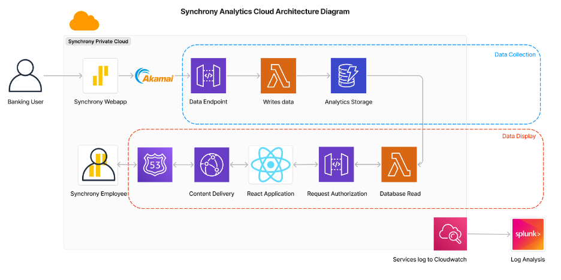

# Synchrony Analytics Cloud Platform Documentation - Backend

#### Colin Gorski

## Table of Contents

1. [System Overview](#1-system-overview---sdp-group-3)
2. [User Data Collection](#3-system-walkthrough---user-data-collection-layer)
3. [Data API](#data-ingestion-api)
4. [Data Writing Function](#data-writing-function)
5. [Data Reading Function](#data-reading-function)
6. [DynamoDB Database](#dynamodb-database)
7. [Monitoring and Logging](#monitoring-and-logging)

## 1. System Overview - SDP Group 3

Our Synchrony Analytics Cloud Platform will be a comprehensive solution for tracking and analyzing user behavior across Synchrony's digital banking platforms. The system captures, processes, and visualizes user interactions to provide actionable insights into customer engagement, feature utilization, and user journeys.

### Key Features

- Real-time data collection about the user's journey on the banking site
- Secure data processing and storage
- Employee-facing analytics dashboard
- Integrated logging and monitoring

## 3. System Architecture Diagram



### Background

Data from the user's interactions on the webstie is collected on the front end script, that is attached to webpages and then send to the data collection endpoint.

## API Gateway

The Synchrony Analytics API provides serverless endpoints for collecting and retrieving user behavior analytics data from Synchrony web applications. The endpoints are implemented using AWS API Gateway and Lambda, storing data in DynamoDB for further analysis.

#### Endpoint Specifications

1. Data Ingestion

   - Base URL: /synchrony_data_analytics
   - Method: POST
   - Content-Type: application/json
   - Authorization: None (CORS enabled)

2. Data Retrieval

   - Base URL: /synchrony_data_analytics
   - Method: GET
   - Content-Type: application/json
   - Authorization: None (CORS enabled)

- Explanation: The POST endpoint adds analytics data to the platform, while the GET endpoint retrieves data filtered by event type. Both endpoints are CORS enabled since requests will be sent from browsers on other sites.

#### Request Format

POST Required Fields:

```json
{
  "event_type": "string", // Type of user event
  "session_id": "string" // Unique session identifier
  // Other fields of interest to be logged
}
```

GET Required Parameters:

```
event_type: string    // Type of user event to query for
```

#### Response Codes

POST Endpoint:

- 201: Successfully created
- 400: Bad request (missing required fields)
- 500: Internal server error

GET Endpoint:

- 200: Successfully retrieved data
- 400: Bad request (missing event_type parameter)
- 500: Internal server error

#### Example Usage

POST Request:

```bash
curl -X POST https://api/synchrony_data_analytics \
  -H "Content-Type: application/json" \
  -d '{
    "event_type": "page_view",
    "session_id": "UUID"
  }'
```

GET Request:

```bash
curl -X GET https://api/synchrony_data_analytics?event_type=page_view
```

Successful GET Response:

```json
[
  {
    "event_type": "page_view",
    "session_id": "UUID"
  }
]
```

Error Response (Missing Parameter):

```json
{
  "error": "Missing required query parameter: event_type"
}
```

#### CORS Configuration

The API supports Cross-Origin Resource Sharing with the following headers:

- Access-Control-Allow-Origin: \*
- Access-Control-Allow-Methods: GET,POST,OPTIONS
- Access-Control-Allow-Headers: Content-Type,X-Amz-Date,Authorization,X-Api-Key,X-Amz-Security-Token

#### Future Improvements

- Add additional required fields for richer analytics, determine more strict data format

  - Instead of just collecting event_type and session_id, we could enhance the data model to include fields like timestamp, user_agent, page_url, event_properties (button_id, form_field, etc.), and device_info. Implementing strict JSON schema validation would ensure fields follow specific formats - for example, timestamps must be ISO-8601, URLs must be valid Synchrony domains, and event_types must match predefined categories.

- Remove proxy integration and add mapping template:

  - Replace the current Lambda proxy integration with a custom integration using API Gateway mapping templates. This gives more control over the request/response transformation and reduces Lambda code complexity. This makes the lambda functions that the API references more reusable, since they can now be called internally and aren't designed to specifically interface with an API.

- Add batch processing capabilities:

  - Modify the endpoints to accept arrays of events and process them in batches using DynamoDB batch operations. This reduces network overhead for high-volume clients and improves throughput. Implement concurrent processing for large batches while handling partial failures gracefully. We can consider adding a queue (SQS) between API Gateway and Lambda for very large batches to ensure reliable processing.

- Implement rate limiting:
  - Configure usage plans and API keys in API Gateway to control how many requests each client can make. In production, this would be implemented using Synchrony's CDN partner, Akamai, in order to prevent a malicious actor from making a massive amount of requests at once.

## Data Writing Function

### Function Overview

This Lambda function serves as the backend processor for the Synchrony Analytics data ingestion API. It receives event data from API Gateway, validates the payload, and stores it in DynamoDB.

### Implementation

```python
import boto3
import json
from boto3.dynamodb.conditions import Key

dynamodb = boto3.resource("dynamodb")
table = dynamodb.Table("SynchronyDataAnalytics")

def generate_response(code, data):
    return {
        "statusCode": code,
        "headers": {
            "Access-Control-Allow-Origin": "*",
            "Access-Control-Allow-Methods": "GET,POST,OPTIONS",
            "Access-Control-Allow-Headers": "Content-Type,X-Amz-Date,Authorization,X-Api-Key,X-Amz-Security-Token",
            "Content-Type": "application/json",
        },
        "body": json.dumps(data),
    }

def lambda_handler(event, context):
    try:
        # Parse the POST body
        body = json.loads(event.get("body", "{}"))

        if not all(k in body for k in ("event_type", "session_id")):
            return generate_response(
                400, {"error": "Missing required fields: event_type and session_id"}
            )
        # Insert into DynamoDB
        item = {
            "event_type": body["event_type"],
            "session_id": body["session_id"],
        }
        table.put_item(Item=item)

        return generate_response(201, {"message": "Data inserted successfully"})
    except Exception as e:
        # Log the exception for debugging
        print(f"Error: {str(e)}")
        return generate_response(
            500, {"error": "Internal server error", "details": str(e)}
        )
```

### Breakdown

#### 1. Dependencies and Setup

```python
import boto3
import json
from boto3.dynamodb.conditions import Key

dynamodb = boto3.resource("dynamodb")
table = dynamodb.Table("SynchronyDataAnalytics")
```

- Uses boto3 for AWS service interaction
- Establishes connection to DynamoDB table
- By creating these resources outside of the handler itself, the function is faster when it is run consecutively, as these resources can exist between executions.

#### 2. Response Generator

```python
def generate_response(code, data):
    return {
        "statusCode": code,
        "headers": {
            "Access-Control-Allow-Origin": "*",
            "Access-Control-Allow-Methods": "GET,POST,OPTIONS",
            "Access-Control-Allow-Headers": "Content-Type,X-Amz-Date,Authorization,X-Api-Key,X-Amz-Security-Token",
            "Content-Type": "application/json",
        },
        "body": json.dumps(data),
    }
```

- Creates standardized API responses
- Handles CORS headers
- Ensures consistent response format
- Automatically JSON encodes the response body

#### 3. Main Handler

```python
def lambda_handler(event, context):
```

- Entry point for Lambda execution
- Receives event data from API Gateway
- Context contains runtime information (not currently used)

#### 4. Data Processing Flow

1. Parse JSON body

   ```python
   body = json.loads(event.get("body", "{}"))
   ```

2. Validate Required Fields

   ```python
   if not all(k in body for k in ("event_type", "session_id")):
   ```

   - Checks for required fields
   - Returns 400 if validation fails

3. DynamoDB Storage

   ```python
   item = {
       "event_type": body["event_type"],
       "session_id": body["session_id"],
   }
   table.put_item(Item=item)
   ```

   - Performs write operation in DynamoDB table

4. Error Handling
   ```python
   except Exception as e:
       print(f"Error: {str(e)}")
   ```
   - Catches all exceptions
   - Returns 500 status code

#### Required IAM Permissions

While with AWS Academy setup, we do not have access to IAM, this is the permission policy that would otherwise be associated with this lambda function.

```json
{
  "Version": "2012-10-17",
  "Statement": [
    {
      "Effect": "Allow",
      "Action": ["dynamodb:PutItem"],
      "Resource": "arn:aws:dynamodb:region:account-id:table/SynchronyDataAnalytics"
    },
    {
      "Effect": "Allow",
      "Action": ["logs:CreateLogGroup", "logs:CreateLogStream", "logs:PutLogEvents"],
      "Resource": "arn:aws:logs:region:account-id:log-group:/aws/lambda/your-function-name:*"
    }
  ]
}
```

#### Future Improvements

1. Input Validation

   - Add JSON schema validation
   - Validate data formats (timestamps, URLs, etc.)
   - Add field length limits

2. Error Handling

   - Add specific error types for different scenarios
   - Implement retry logic for DynamoDB failures
   - Add structured error logging

3. Performance
   - Add caching
   - Consider batch processing

## Data Reading Function

### Function Overview

This Lambda function serves as the backend processor for the Synchrony Analytics data retrieval API. It receives query parameters from API Gateway, validates them, and retrieves matching records from DynamoDB.

### Implementation

```python
import boto3
import json
from boto3.dynamodb.conditions import Key

dynamodb = boto3.resource("dynamodb")
table = dynamodb.Table("SynchronyDataAnalytics")


def generate_response(code, data):
    return {
        "statusCode": code,
        "headers": {
            "Access-Control-Allow-Origin": "*",
            "Access-Control-Allow-Methods": "GET,POST,OPTIONS",
            "Access-Control-Allow-Headers": "Content-Type,X-Amz-Date,Authorization,X-Api-Key,X-Amz-Security-Token",
            "Content-Type": "application/json",
        },
        "body": json.dumps(data),
    }


def lambda_handler(event, context):
    try:
        # Extract query parameters
        query_params = event.get("queryStringParameters", {})

        print(query_params)
        print(query_params["event_type"])

        if not query_params or "event_type" not in query_params:
            return generate_response(
                400, {"error": "Missing required query parameter: event_type"}
            )
        # Fetch from DynamoDB
        response = table.query(
            KeyConditionExpression=Key("event_type").eq(query_params["event_type"])
        )
        return generate_response(200, response.get("Items", {}))
    except Exception as e:
        # Log the exception for debugging
        print(f"Error: {str(e)}")
        return generate_response(
            500, {"error": "Internal server error", "details": str(e)}
        )
```

### Breakdown

#### Dependencies and Setup

```python
import boto3
import json
from boto3.dynamodb.conditions import Key

dynamodb = boto3.resource("dynamodb")
table = dynamodb.Table("SynchronyDataAnalytics")
```

- By creating these resources outside of the handler itself, the function is faster when it is run consecutively, as these resources can exist between executions.

#### 2. Response Generator

```python
def generate_response(code, data):
    return {
        "statusCode": code,
        "headers": {
            "Access-Control-Allow-Origin": "*",
            "Access-Control-Allow-Methods": "GET,POST,OPTIONS",
            "Access-Control-Allow-Headers": "Content-Type,X-Amz-Date,Authorization,X-Api-Key,X-Amz-Security-Token",
            "Content-Type": "application/json",
        },
        "body": json.dumps(data),
    }
```

- Creates standardized API responses
- Handles CORS headers
- Ensures consistent response format
- Automatically JSON encodes the response body

#### 3. Main Handler

```python
def lambda_handler(event, context):
```

- Entry point for Lambda execution

#### 4. Data Processing Flow

1. Extract Query Parameters

   ```python
   query_params = event.get("queryStringParameters", {})
   ```

2. Validate Required Parameters

   ```python
   if not query_params or "event_type" not in query_params:
   ```

   - Checks for required event_type parameter
   - Returns 400 if validation fails

3. DynamoDB Query

   ```python
   response = table.query(
       KeyConditionExpression=Key("event_type").eq(query_params["event_type"])
   )
   ```

   - Queries DynamoDB using event_type as partition key
   - Returns all matching items

4. Error Handling
   ```python
   except Exception as e:
       print(f"Error: {str(e)}")
   ```
   - Catches all exceptions
   - Returns 500 status code

#### Required IAM Permissions

While with AWS Academy setup, we do not have access to IAM, this is the permission policy that would otherwise be associated with this lambda function.

```json
{
  "Version": "2012-10-17",
  "Statement": [
    {
      "Effect": "Allow",
      "Action": ["dynamodb:Query"],
      "Resource": "arn:aws:dynamodb:region:account-id:table/SynchronyDataAnalytics"
    },
    {
      "Effect": "Allow",
      "Action": ["logs:CreateLogGroup", "logs:CreateLogStream", "logs:PutLogEvents"],
      "Resource": "arn:aws:logs:region:account-id:log-group:/aws/lambda/your-function-name:*"
    }
  ]
}
```

#### Future Improvements

1. Input Validation

   - Add JSON schema validation
   - Validate data formats (timestamps, URLs, etc.)
   - Add field length limits

2. Error Handling

   - Add specific error types for different scenarios
   - Implement retry logic for DynamoDB failures
   - Add structured error logging

3. Performance
   - Add caching
   - Consider batch processing

## DynamoDB Database

### Key Schema

1. Partition Key (HASH)

   - event_type (String)
   - Used to identify different types of tracked events
   - Will not be unique

2. Sort Key (RANGE)
   - session_id (String)
   - Enables querying events within specific user sessions
   - Will be unique in conjunction with event_type

## Primary Access Patterns

1. Get events by type

```python
# Query all events of a specific type (e.g., 'page_view')
QueryInput: {
    KeyConditionExpression: 'event_type = :eventType',
    ExpressionAttributeValues: {
        ':eventType': 'page_view'
    }
}
```

2. Get events for specific session

```python
# Query events for a specific session within an event type
QueryInput: {
    KeyConditionExpression: 'event_type = :eventType AND session_id = :sessionId',
    ExpressionAttributeValues: {
        ':eventType': 'page_view',
        ':sessionId': 'user123_session456'
    }
}
```

### Future Improvements

1. More Specific Data Model

   - The exact format of the data we are collecting is not set in stone yet. DynamoDB is advantageous for this case since it is flexible, but having a more consistent model will make the data usable.

2. Add Global Secondary Indexes (GSIs)

   - GSIs enable the table to have more access patterns that are also efficient. Page URL may be a good candidate for this, if we want quick access to analytics about a specific page and all of its events.

## Monitoring and Logging

Currently, both Lambda functions utilize basic CloudWatch logging through Python print statements, which automatically stream to CloudWatch Logs. Each function logs error messages and query parameters, providing basic debugging capabilities.

### Future Improvements

- This logging approach will be enhanced to include structured JSON logging with additional context such as timestamp, request ID, user session information, and execution duration metrics.
- CloudWatch Alarms can be set up to monitor error rates, latency, and throttling events. Custom metrics will be added to track business-relevant data like event types processed, query patterns, and response times.
- In production, logs will be aggregated to Splunk, a service Synchrony uses for centralized logging and monitoring. This allows for more advanced analytics, alerting, and correlation across different services.
